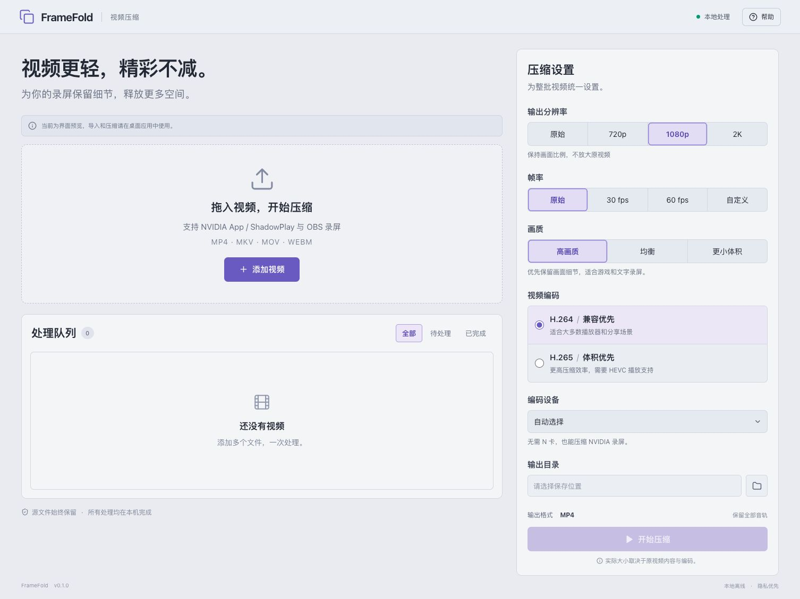

# FrameFold

Windows 视频批量压缩工具，重点兼容 **NVIDIA App / ShadowPlay、OBS 录制的视频**。这指输入文件兼容性，处理这些视频不要求拥有 NVIDIA 显卡。

采用 **Tauri 2 + Rust + React / TypeScript + FFmpeg**。界面为非纯白浅灰配色，全部视频在本机处理。



## 已实现

- 原生多选导入、拖入文件、逐项媒体探测；批量顺序处理、取消当前任务/停止批次、失败重试。
- MP4 输出，H.264 兼容优先 / H.265 体积优先；高画质、均衡、更小体积。
- 原始、720p、1080p、2K（2560×1440）；按比例缩小，兼容竖屏/旋转信息，不放大原视频。
- 原始时间戳、30/60 fps、自定义 1–240 fps（支持 29.97 等小数）。升帧不包含运动插帧。
- 全部音轨保留，AAC 复制，其他音频转 AAC，保留标题和语言。
- HDR→SDR 色调映射；选择 HEVC 可保留 HDR10/HLG 信息。保留 HDR 使用 CPU x265，显式 NVIDIA+HDR 保留会提示调整设备。
- 自动检测可用编码器，NVENC 实际短编码检测；无 NVIDIA 支持可用 CPU。
- 实际进度、速度、预计剩余时间、批量进度、输出大小及节省比例。已经高效压缩的源视频可能得到更大输出。
- 原文件保留、自动避开同名结果、临时文件及输出校验；中文/空格路径支持。

## 开发运行

需要 Node.js **24 LTS**、Rust stable，以及系统对应的 Tauri 开发依赖。Windows 需要 Visual Studio Build Tools 的“使用 C++ 的桌面开发”和 WebView2。

```sh
npm ci
npm run desktop
```

开发环境需在 PATH 中提供 `ffmpeg` 和 `ffprobe`，或指定：

```powershell
$env:VIDEO_COMPRESS_FFMPEG = 'C:\tools\ffmpeg.exe'
$env:VIDEO_COMPRESS_FFPROBE = 'C:\tools\ffprobe.exe'
npm run desktop
```

macOS 本机开发与 HDR 验证可使用完整 FFmpeg：

```sh
brew install ffmpeg-full
export VIDEO_COMPRESS_FFMPEG=/opt/homebrew/opt/ffmpeg-full/bin/ffmpeg
export VIDEO_COMPRESS_FFPROBE=/opt/homebrew/opt/ffmpeg-full/bin/ffprobe
npm run desktop
```

`npm run dev` 仅提供浏览器界面预览，**不能压缩视频，也不会模拟处理结果**。桌面启动命令会自动启动前端，请先停止单独运行的同端口开发服务。

## Windows 轻量便携 ZIP

软件只处理已有视频，不提供录屏功能。轻量版使用系统已有的 Microsoft Edge WebView2 Runtime；缺少时显示原生提示，不静默下载或安装。

完整解压 `release/FrameFold-0.1.0-windows-x64-lite.zip`，双击 `FrameFold.exe`。保留 `binaries` 内所有 DLL。包内使用固定版本 FFmpeg 8.0.1 共享构建，让 ffmpeg 与 ffprobe 共用一套媒体库；保留 H.264/HEVC、HDR、多音轨等已有能力，不携带播放器和开发 SDK。

Windows 本机构建：

```powershell
npm ci
npm run build:windows
pwsh -File scripts/test-portable.ps1
```

Windows 打包前更新 Defender 病毒库并扫描，失败则停止。可通过 `FRAMEFOLD_SIGN_THUMBPRINT` 使用构建机器证书存储区中的证书签名（signtool 需在 PATH）。没有证书时不伪造签名；新发布程序仍可能出现 SmartScreen 信誉提示。

## Mac 本地交叉编译

不使用 GitHub Actions 或远端构建。首次准备：

```sh
brew install llvm lld
rustup target add x86_64-pc-windows-msvc
python3 -m venv .cache/cross-tools
.cache/cross-tools/bin/pip install --index-url https://pypi.org/simple cargo-xwin==0.23.1
npm ci
npm run build:windows:mac
```

编译与 ZIP 组装全部在本机执行，仅下载构建依赖。固定 FFmpeg 发行归档通过发布者 SHA-256 校验；产物包含 `BUILD-INFO.txt` 和 SHA-256 清单。Mac 生成的是未签名 Windows Release 测试包，未执行 Windows Defender 扫描与 Windows 真机启动验收。

## 验证

```sh
npm test
npm run build
cargo test --manifest-path src-tauri/Cargo.toml --locked
cargo clippy --manifest-path src-tauri/Cargo.toml --all-targets -- -D warnings
# 需要真实 FFmpeg/ffprobe：
cargo test --manifest-path src-tauri/Cargo.toml --test real_media -- --ignored --test-threads=1
```

真实媒体测试覆盖中文路径、多音轨、音轨语言/名称、小数帧率、损坏输入隔离、重名保护、取消清理、HDR 转换/保留及旋转视频。源码核心也可用 `--no-default-features` 独立测试。

## 当前边界

- 尚无实际 NVIDIA/OBS 原始样本提供：兼容性测试使用合成的对应编码、音轨、色彩及旋转组合；品牌录制软件的真实样本还需验收。
- 画质预设是可用起点，未针对大量真实游戏录屏做感知指标标定，不保证无损或固定压缩比。
- 首版顺序编码；不提供暂停编码后续传。关闭应用会取消运行中的批次。
- 设置会保留，任务历史不跨进程持久化。浏览器刷新可重新读取当前桌面进程中的队列。
- NTFS/APFS 使用硬链接原子发布；exFAT 等使用不覆盖已有文件的独占创建复制，复制失败会清理本次新建文件。
- Windows 主程序尚未配置发布者签名。公开分发前应配置代码签名，并补齐所携带 GPL FFmpeg 及依赖的对应源码材料；脚本内的来源链接不等于完整的再分发合规包。

架构与 IPC 见 `docs/ipc.md`，验证记录见 `docs/verification.md`。
